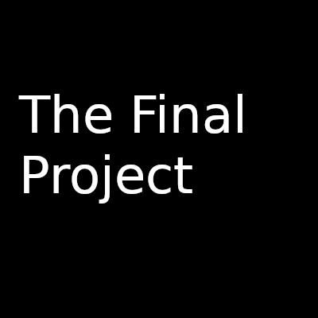

layout: page
title: Game Engines Final Project
permalink: /GameEngines/

# The Final Project!

- For this assignment you are going to be building a 'Game Maker' as your final project! 
- You will use your engine to make a game with at least '3' scenes.

## Logistics

- You will put all of your code and deliverables in the [Engine](./Engine) directory.
	- You can have a separate 'game' directory if you otherwise choose.
<!-- NOTE:  This semester you will be completing the project yourself.
- You will be working on this assignment as a team on your choice (or a combination) of the Mac, Linux, or Windows Operating Sytstem.
- Make sure everyone has a way to work on this codebase, with a common set of tools.
- Everyone should make code contributions to the repository (i.e. everyone should have some commits in the project log)

## Team

Team Name: *Edit this to something cool here*

*TODO*:
Update your Team member Names here (Up to 4).

1. *my name is...*
2. *my name is...*
3. *my name is...*
4. *my name is...*
-->

## Assignment Milestones

1. [Part 1 README](./part1_README.md) 
 	* Read the project description
2. [Part 2 README](./part2_README.md) 
 	* More specific requierments of the project and who is going to be responsible for each part
3. [Part 3 README](./part3_README.md) 
 	* Portfolio instructions 	
<!--4. Team member Evaluation: https://forms.gle/qiD6guzN5W5LxAcV9
 	* **This must be filled out before the project is due.**
-->

## Universal Resources

You will be using SDL to build this project and the same libraries that we have been using during the semester.

* General SDL programming tutorials: 
  * http://lazyfoo.net/tutorials/SDL/
  * [Mike's SDL Playlist](https://www.youtube.com/playlist?list=PLvv0ScY6vfd-p1gSnbQhY7vMe2rng0IL0)

# Part 1 and 2 Rubric
   
<table>
  <tbody>
    <tr>
      <th>Points</th>
      <th align="center">Description</th>
    </tr>	  
    <tr>
      <td>25% (Engineering/Design Patterns)</td>
      <td align="left">On the polish of your final project (did it work as intended, were there bugs, did I have to struggle to get your tool running, was your solution well engineered, were there patterns used, etc.)</td>
    </tr>
    <tr>
      <td>40%  (Requirements)</td>
      <td align="left">Did you complete all of the requirements from part 2?</td>
    </tr>
    <tr>
      <td>15%% (Wow Factor)</td>
      <td align="left">On the creativity and overall 'wow' factor of your project. Was there a cool feature or surprise that got me excited about the project? Does this project have potential to be extended in the future? Were there creative additional tools that supported your work. Was there something not covered in class that you were excited about, learned, and implemented anyway? (Document this to bring to my attention if so!)</td>
    </tr>
  </tbody>
</table>

# Part 3 - Rubric

<table>
  <tbody>
    <tr>
      <th>Points</th>
      <th align="center">Description</th>
    </tr>
    <tr>
      <td>4% (Engine Architecture diagram)</td>
      <td align="left">Did you add the engine architecture diagram to your website "./media/C4Engine.pdf"?</td>
    </tr>   	  
    <tr>
      <td>4% (Documentation)</td>
      <td align="left">Did you generate something like "http://www.horde3d.org/docs/html/_api.html"?</td>
    </tr>    
    <tr>
      <td>4% (Build)</td>
      <td align="left">Does the build work when I download your repo and run the game?</td>
    </tr>
    <tr>
      <td>4% (Post mortem)</td>
      <td align="left">Did you learn anything and provide a brief and well-thought out reflection of these learnings?</td>
    </tr>
    <tr>
      <td>4% (Website)</td>
      <td align="left">Do you have a webpage that presents your project in a positive way with the above materials.</td>
    </tr>
  </tbody>
</table>
